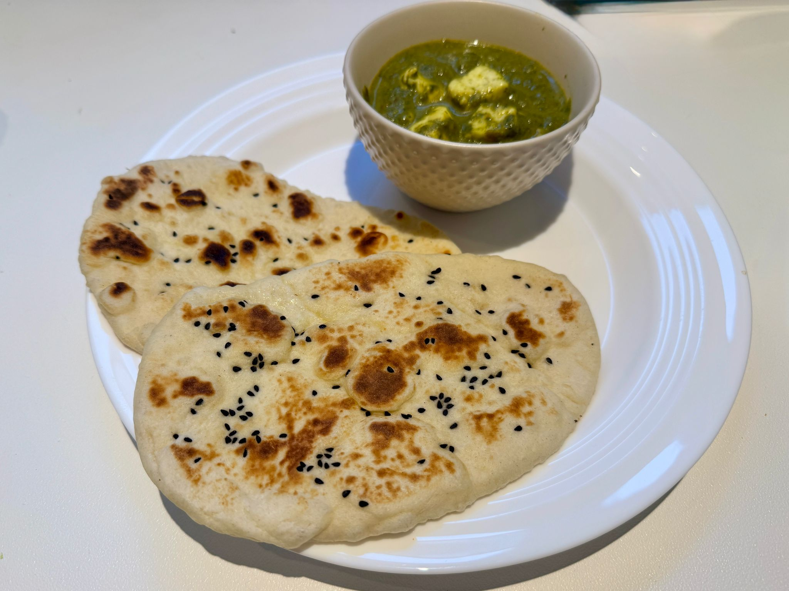

# Naan (Indian flat bread)

Fluffy flat indian bread, perfect to accompany any indian meal.
The name 'naan' already means 'bread'.

!!! Tip
    You can make other types of naan by garnishing it before cooking it.
    For example, put minced garlic on top to make garlic naan.

---

**Ingredients** (6 portions)

- _Flour_ (250 g)
- _Yoghurt_
- _Yeast_ (4~5 g dry)
- _Salt and suggar_ (1 teaspoon each)
- _Baking powder_ (1 teaspoon)
- _Warm milk_ (160 mL)

---

**Steps**

1. Disolve in the milk the yeast and let it rest for :clock: 5 minutes to activate the yeast.
2. In a bowl mix all the dry ingredients. Add the yoghurt and mix it as well as possible.
3. Add little by little the milk integrating it until a dough is formed.
4. Knead the dough for :clock: 10~15 minutes, until it becomes smooth.
5. Put the dough to rest for :clock: 1 hour in a warm place.
6. Separate the dough in 6 balls and let them rest for a few minutes. Meanwhile, preheat a pan on medium-high heat  
7. Roll each ball into the final shape. For it, start flatting it on your palm, then roll it on a surface until it is around 12 cm x 20 cm.
8. Cook each naan on the pan for :clock: 20~30 seconds until it start to bubble on each side. 
9. Flip it again and press down with the spatula to fully cook it everywhere. Do this on both sides. 
