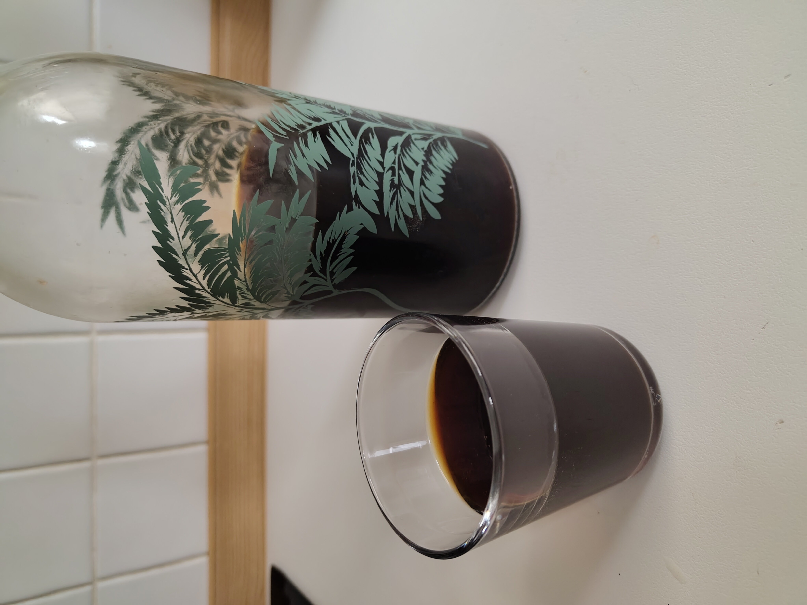

---
tags:
  - Drink
  - Japanese
---

# Cold Brew (Coffee)

The cold brew actually originated in Japan as a way to avoid using fire to make a drink.

---

**Ingredients**

- _Water_ (800 mL)
- _Coffee beans_ (100 g)

---

1. Grind the coffee leaving a coarse result. You can also use already milled coffee from the store.
2. Put in a container the coffee and the water and gently mix everything together.
3. Let it sit in the fridge for :clock: 48 hours for maximum flavour.
4. Use a cheese-cloth to filter the coffee and enjoy it with some ice.

!!! Warning
    The cold brew times are from 1 to 3 days. Afterward it becomes bitter.
