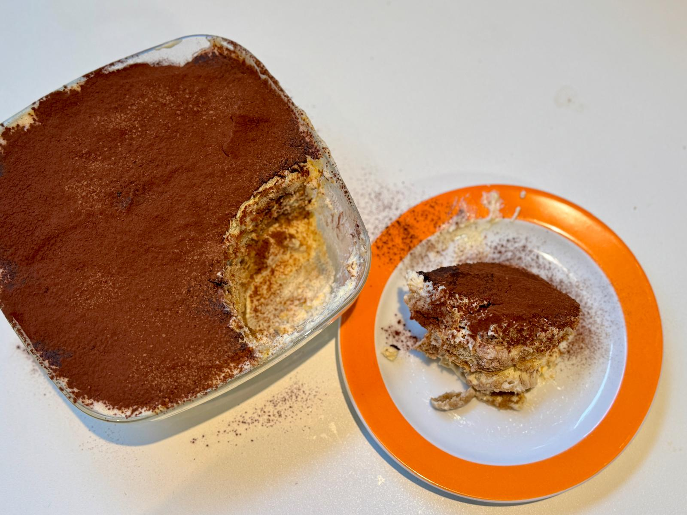

---
tags:
  - Dessert
  - Italian
  - Mediterranean
  - Sweet
  - Vegetarian
---

# Tiramisu

A perfect dessert which becomes more tasty if you let it rest overnight before eating it.

---

**Ingredients**

- _Ladyfingers_
- _Coffee_ (1 espresso)
- _Sugar_ (120 g)
- _Eggs_ (4 medium)
- _Mascarpone_ (500 g)
- _Bitter cocoa powder_
- _Orange liquor_ (Optional) — Mixed with the coffee

---

**Steps**

1. Prepare two different bowls to make the Mascarpone-batter. Separate the eggs' whites and yolks in these bowls.
2. Mix the yolks with half of the sugar and mix until homogeneous. Add the Mascarpone and mix until there is no clumps.
3. For the whites, mix the other half of the sugar in them and beat them until soft peaks ("punto de nieve").
4. Bix the yolk mixture into the white mixture in small batches, folding the mixture to integrate them.
5. Prepare the bold that will have the mascarpone with a thin base of the batter.
6. Make a layer of ladyfingers on top of the previous layer. Each ladyfinger must first go quickly in-and-out the coffee (less than 1 second).
7. Put a layer of the Mascarpone-batter. Repeat this step together with step 6 until the mold is full.
8. The last layer should be a batter layer, where some cocoa is then sprinkled on top.
9. Let it rest minimum :clock: 2 hours in the fridge, but recommended to let it sit at least :clock: 8 hours (overnight).
