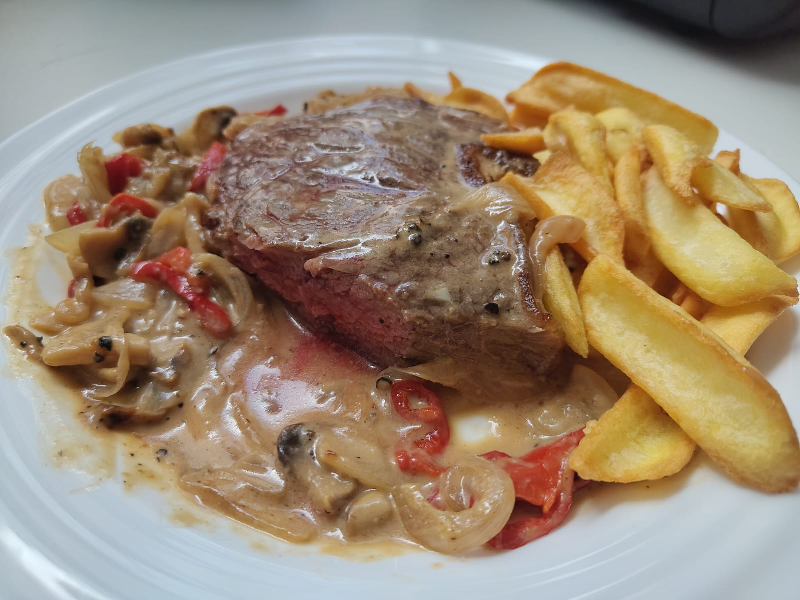

# Whisky Steak (Filete al Whisky)

Chile also has a "whisky steak" recipe, but the sauce is vastly different.
When this recipe is cooked with thin pork fillets, then it can also be considered a tapa.

---

**Ingredients** (1 portion)

- _Steak_ - Either cow or pork, whatever you like
- _Cooking cream_ (100 mL) - 15% fat
- _Onion_ (1 medium / 2 small)
- _Mushrooms_ (2~4)
- _Red pepper_
- _Salt & pepper_
- _Whisky_ (30 ~ 60 mL)

!!! Tip
    You could also serve this plate with some french fries.

---

**Steps**

1. Chop the onion and the mushroom in thin slices. Chop also the red pepper in rings.
2. Put some neutral oil together with a little bit of butter in a pan and heat it up at medium-high power.
3. When the butter is melted, add all previously chopped vegetables. Put a pinch of salt on top and let it cook until golden. Stir occasionally.
4. While the saddlery is cooking, prepare the steak with some salt and pepper on each side, rubbing it so it integrates well with the meat before cooking it.
5. Take the vegetables out of the pan and keep them aside. Put the steak in the pan and cook it for :clock: 2~4 minutes on each side.
6. After the steak looks cooked on the outside and sealed, pour the cooking cream together with some whisky. Beware of it not spilling out of the heat. Keep moving the sauce from the bottom of the pan on top of the steak. Additionally, put some crushed pepper balls too.
7. After the sauce has reduced half-way, add all the vegetables and integrate them together with the sauce.
8. Let the sauce reduce a little bit more. To plate it, put first the steak on the plate, then pour the saddlery on top.
