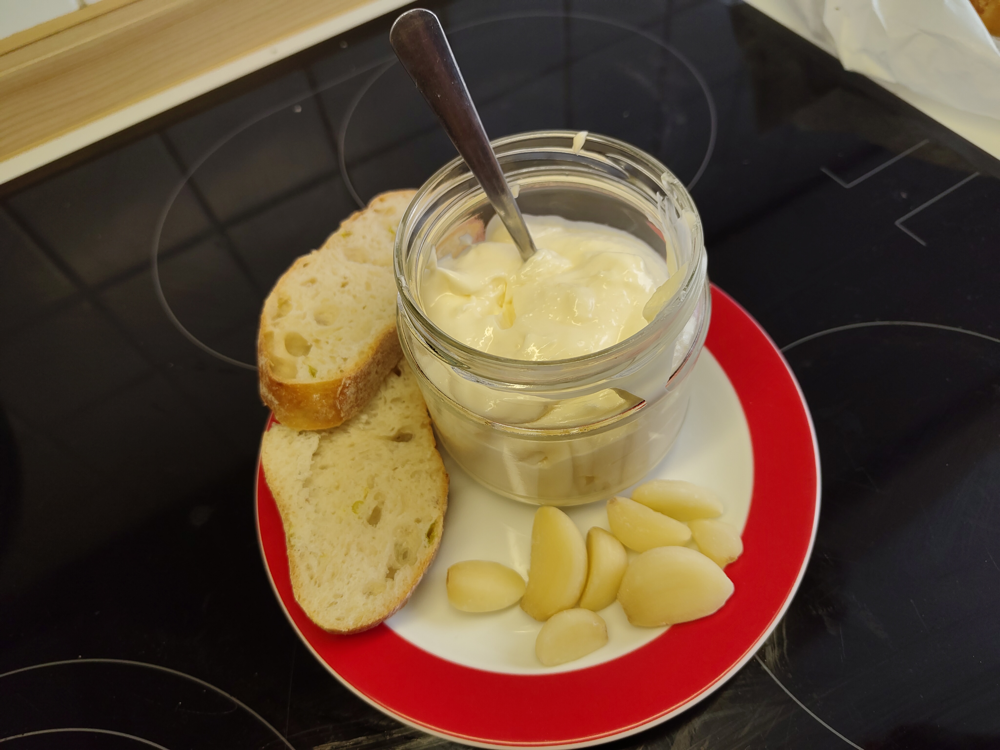

# Aioli (Alioli)

The name literally means "garlic and oil".
This is delicious as a dipping sauce or to serve with some potatoes.

---

**Ingredients**

- _Egg_ (1 medium)
- _Sunflower oil_ (200 mL or 170 g) — Other oils can be used to provide a stronger flavour.
- _Garlic_ (4 cloves)
- _Salt_ (A pinch)
- _Lemon_ (A splash) — It can be substituted by vinegar

!!! Note
    It is important to have a hand-blender for the recipe.

!!! Hint
    This is the same recipe as a mayonnaise if the garlic is skipped.

---

**Steps**

1. Put all the ingredients in the hand-blender glass.
2. Introduce the blender to the bottom of the container, then start the blender to maximum power and don't move it for :clock: 20~30 seconds.
3. Slowly move up the blender while it is still working. When it reaches the top, then you can move the blender more freely.
