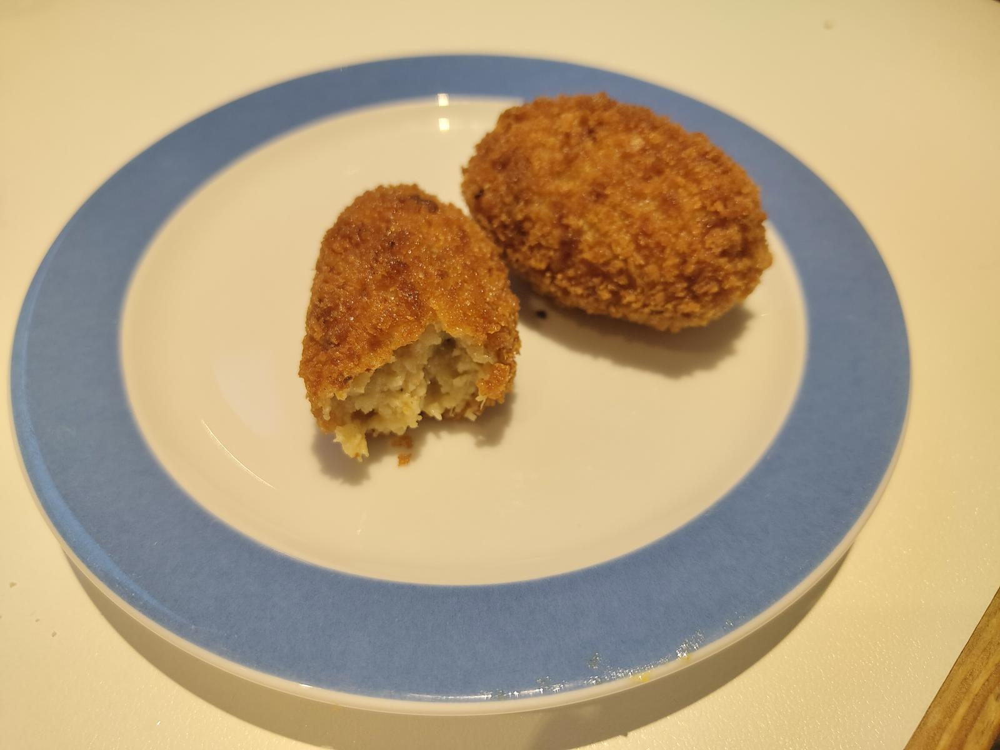

---
tags:
  - Tapas
  - Mediterranean
  - Spanish
  - Leftover-saving
  - Side-dish
---

# Croquetas (Spanish croquets)

One of the most loved recipes for any spaniard.
There is even a saying in Spain: _Quien te quiere te hará croquetas_ (Who loves you will cook croquetas for you)

---

**Ingredients**

- _1 onion_
- _Olive oil_ (35 mL)
- _Butter_ (35 g)
- _Flour_ (50 g)
- _Corn flour_ (20 g)
- _Broth_ (200 mL) - Recommended chicken broth, but it can be any type.
- _Milk_ (250 mL approx.) - Should be lukewarm.
- _Filling_ - Meat (chicken or pork cubes), mushrooms or anything your heart desires.
- _Egg, flour and bread crumbs_

!!! Note
    The filling is usually previous food scraps, like the chicken leftovers from the previous day.

!!! Tip
    This recipe is perfect to keep it in the freezer as a meal prep.

---

**Steps**

1. Prepare the filling in small pieces. The filling should be cooked, so fry it in case it is raw.
2. Chop the onion in small pieces. Add the oil and butter to a pot and stir-fry the onion at medium heat with some salt until it becomes golden. 
3. Add the flour and corn flour and let it cook at low flame for :clock: 2~3 minutes.
4. Add the broth while stirring until it is well incorporated. Add it little by little and don't stop stirring to avoid lumps.
5. Add the milk just like in the previous step. Cook it at mid-low fire until it thickens to a point that you can pass the spoon through it, making a path, and the sides do not merge very fast.
6. When the béchamel is ready, add the filling. Mix well all together and turn off the fire.
7. Put the mix in a container, lay some plastic film on top (to avoid a crust to form) and move the container into the fridge. Let it rest at least :clock: 4 hours.
8. Give the croquets shape, one way is to use two soup spoons. Then put each one in flour, then egg and then bread. Optionally, you can coat each croquet twice for it to have a more consistent crust.
9. Leave your croquetas in a tupper in the freezer until you want to cook them.
10. Cook each croqueta in oil, deep-frying it. Baking it won't work the same.
