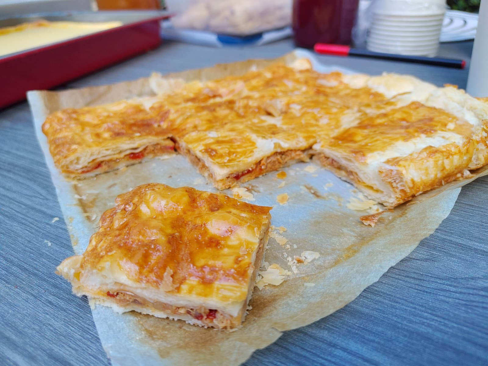

---
tags:
  - Spanish
  - Oven
  - Savory
  - Party-food
  - Side-dish
  - Tapas
---

# Empanada Gallega

A traditional savory double-crusted pie from the Galicia region of northwestern Spain.
Baked as a large, flat rectangle or circle on a baking sheet, it is cut into squares and typically served at room temperature as an appetizer or tapa.

---

**Ingredients**

- _Onion_ (3 medium)
- _Canned tuna_ (300 g / 2 cans) - It's better if one is "tuna in olive oil" and the other without any oil.
- _Baked red pepper_ (1 can)
- _Puff pastry_ (2 sheets) - Also known as "Blätterteig" (DE) or "Hojaldre" (ES)
- _Egg_ (1 medium)

---

**Steps**

1. Chop all the onions in thin slices.
2. To caramelize the onions, put them first in the microwave for :clock: 2:30 ~ 3 minutes. Then put them in a pot with a nice amount of oil at medium heat and put salt on them. Cook them for :clock: 10 ~ 15 minutes until brown.
3. Open the tuna cans, then put the one with oil (oil included) in the pot with the onion. Strain the other can and add it also to the pot. Stir occasionally keeping the fire at medium heat.
4. Take the peppers and chop them in cubes of half centimeter. Add them to the pot with everything else.
5. After cooking everything for another :clock: 10 minutes, add sweet paprika powder and cook it for another :clock: 2 ~ 3 minutes.
6. Add one tomato (in pure) or a little bit of tomato paste with water. Turn of the fire and cook it with the residual heat for another :clock: 5 minutes.
7. (Optional) Add a litte bit of oregano and stir it for the last time.
8. Preheat the oven at 180 °C. Meanwhile, prepare the puff pastry sheets by stabbing them with a fork.
9. Fill the sheats, either by filling one by half and folding it or by filling one full and putting the other sheet on top.
10. Bake the empanada for :clock: 10 minutes. Meanwhile, take 1 egg and stir it.
11. After the first bake, take the empanada out and paint it with the egg. Bake again for another :clock: 20 ~ 30 minutes.
12. Let it sit for around :clock: 15 minutes before chopping it.
