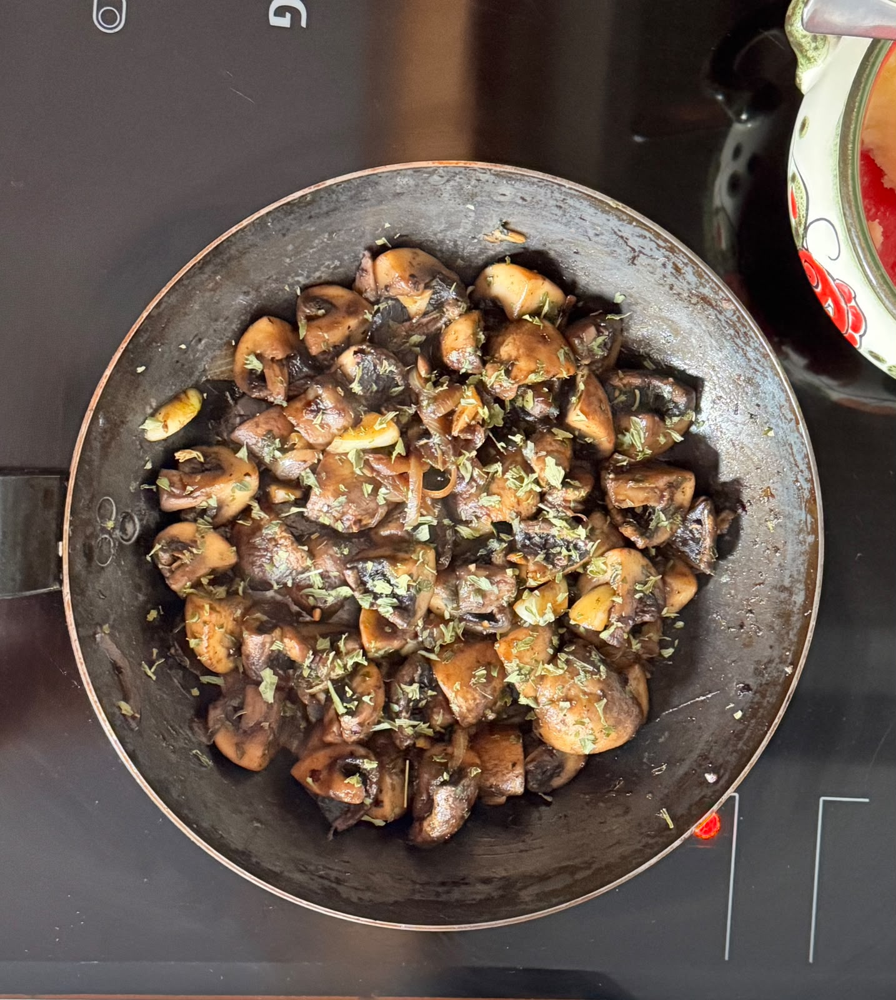

# Saute Mushrooms

---

**Ingredients**

- _Mushrooms_ (200 g)
- _Garlic_ (3 cloves)
- _BUtter_ (Heart's desire)
- _Salt_
- _Parsley_

---

**Steps**

1. Chop all the mushrooms in quarters and the garlic fine.
2. Put the butter in the pan at mid-heat and wait until it is fully melted.
3. Add the garlic and cook it for :clock: 30 seconds.
4. Add the mushrooms and cook for :clock: 10 - 12 minutes, adding salt and pepper.
5. Add parsley and plate it.
