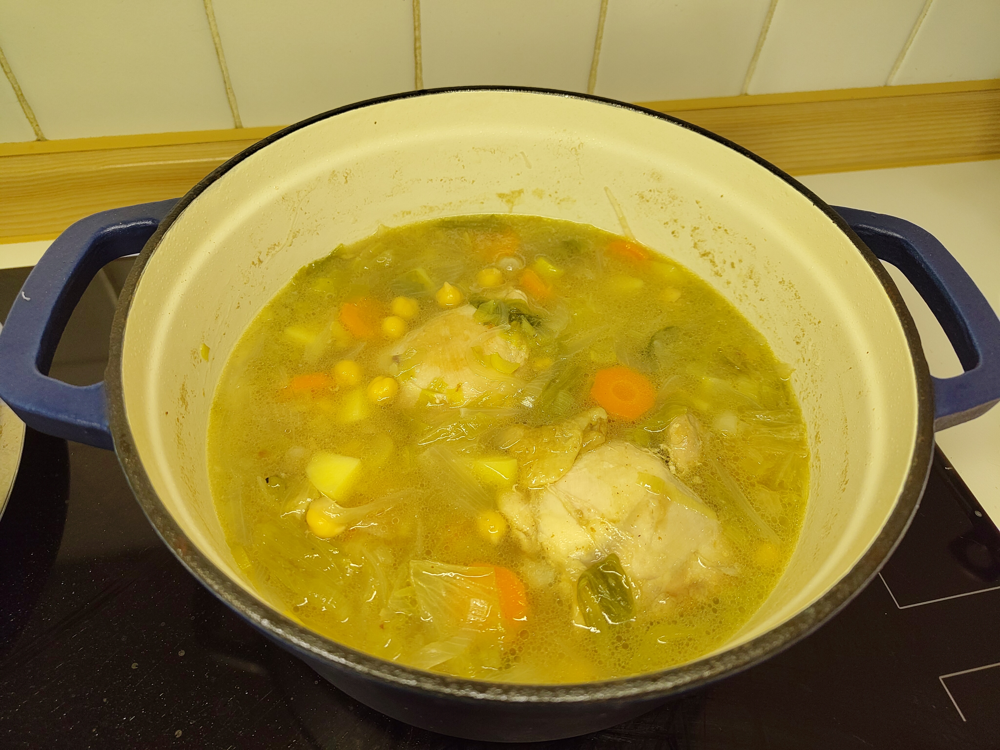

# Gypsy Pot (Olla Gitana)

Simple and delicious recipe that actually requires few ingredients.

---

**Ingredients** (2-3 servings)

- _Chicken legs_ (350 g)
- _Chickpeas_ (200 g)
- _Lettuce_ or _cabbage_
- _Onion_ (1 medium)
- _Garlic_ (2 cloves)
- _Potato_ (2 small)
- _Carrot_ (1 medium)
- _Salt and pepper_

!!! Note
    You could add more or other vegetables you find suitable for any soup.

---

**Steps**

1. Soak the chickpeas for :clock: 8 hours. Afterward, you can also precook them in a pressure pot.
2. Put the chicken (skin down) on the pot and cook it at medium-low heat for :clock: 5~7 minutes on each side. We want the chicken to release some fat for flavor, and there is no need for it to fully cook yet.
3. Prepare all the vegetables: Smash the garlic and chop it in thick pieces, chop the onion in slices, peel the potato and the carrot and chop them in small pieces.
4. Take the chicken outside the pot, then add oil and put the garlic and the onion. Let it cook for another :clock: 7 minutes at medium-low heat or until golden.
5. Add the carrot, the potato and put the chicken back in. Fill everything with water until all ingredients are submerge, add salt and pepper, then put the fire to high until it starts boiling.
6. Meanwhile, chop the lettuce or cabbage in bite-sizes. Add them to the pot, lower the fire to medium-heat and cover it with a lid. Let it cook for :clock: 20 minutes, until the water becomes full of color.
