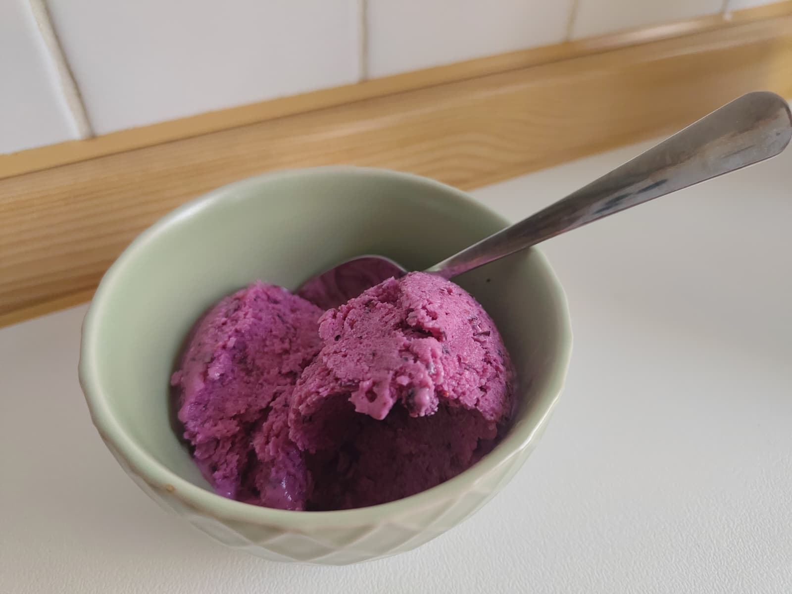

# Frozen Fruit Yoghurt (Ice-Cream)

A delicious and easy recipe with just three ingredients.
I recommend to buy the frozen fruit, as it is almost already prepared for the recipe.

---

**Ingredients**

- _Yoghurt_ (600 g)
- _Frozen blueberries_ (200 g) - or any other fruit
- _Sweetener_ (20 g)

!!! Tip
    You can substitute the sweetener for honey. Use 1 teaspoon per 100 grams of yoghurt.

---

**Steps**

1. Put the yoghurt in a cheese-cloth and strain all the liquid. For this step is not needed to press the cloth, just let it sit with a little bit of height.
2. If your fruit is too big, chop it in small pieces.
3. Add all ingredients in the food processor and mix it for :clock: 30 seconds.
4. Put the mix in a tupper and put it in the freezer for :clock: 1 hour.
5. After :clock: 1 hour, with a spoon lightly stir the mix.
6. Repeat the previous step 3-5 more times to avoid the yoghurt to become a block of ice. Then it will be ready.
