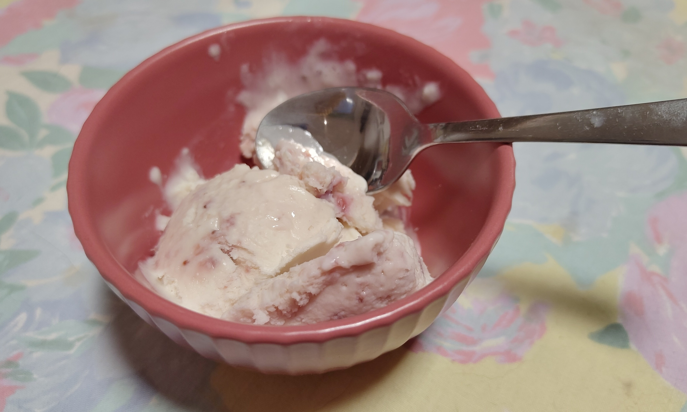

# Strawberry (Jam) Ice-Cream

This is a very easy **three ingredients** recipe.
It is perfect to create any ice-cream flavor by using just jam or confiture.

---

**Ingredients**

- _Condensed milk_ (200 mL)
- _Strawberry jam_ (100 g)
- _Whipping cream_ (200 mL)

---

**Steps**

1. Put the whipping cream for :clock: 30 minutes in the freezer or for at least :clock: 2 hours in the fridge before starting the recipe.
2. In a big bowl mix the jam and the condensed milk until they are well incorporated.
3. Prepare the whipping cream until it is fluffy. The texture should be similar to whipped egg-whites, but with a little bit less volume.
4. Fold the jam-condense milk mix into the whipping cream. Do this step with slow movements to not de-air the whipping cream.
5. Put the mixture in a tupperware, then put it in the freezer for :clock: 8 hours and enjoy.

!!! Note
    Usually the ice-cream recipes require to break the ice every hour.
    In this recipe, the whipping cream helps the ice-cream to have a nice texture without checking the ice-cream sporadically.
